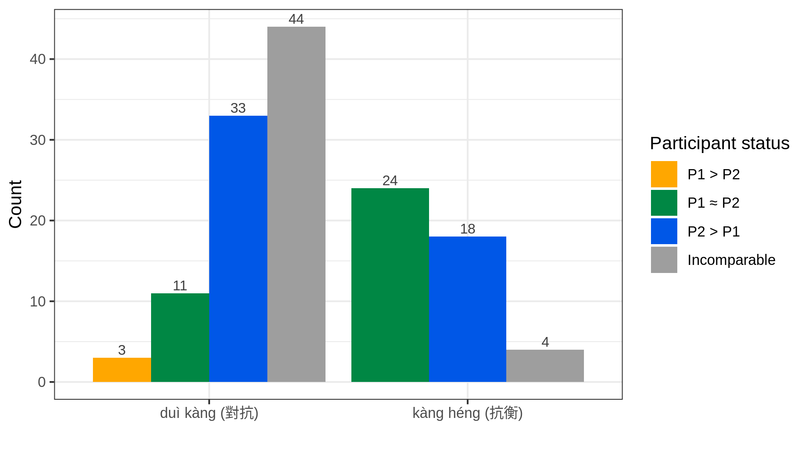
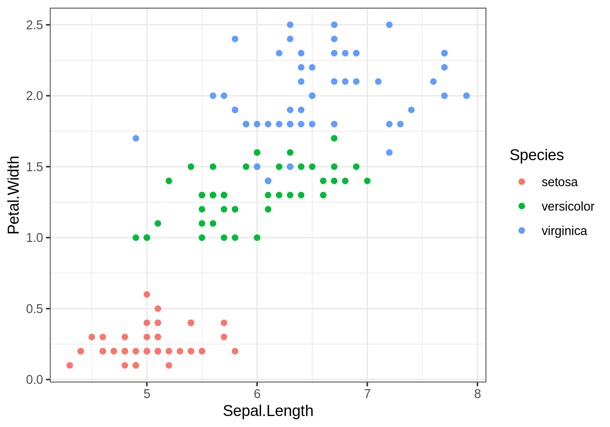

```{r setup, include=FALSE}
knitr::opts_chunk$set(
	echo = FALSE,
	message = FALSE,
	warning = FALSE
)
```


如何將此 Rmd 輸出成 PDF?  
依序執行下方指令：

```r
rmarkdown::render("index.Rmd")
pagedown::chrome_print("index.html")
```


簡介
=====================

請簡要說明你們的專案

```{r, fig.cap='A bar chart'}

```

方法
=====================

請在這裡寫下方法。請在這裡寫下方法。請在這裡寫下方法。請在這裡寫下方法。請在這裡寫下方法。

## 資料取得

## 原始碼運作說明

```{r, fig.cap='iris scatter plot'}

```


結果
=====================

請在這裡寫下結果。請在這裡寫下結果。請在這裡寫下結果。請在這裡寫下結果。請在這裡寫下結果。請在這裡寫下結果。


討論與貢獻
=====================

請在這裡寫下討論。請在這裡寫下討論。請在這裡寫下討論。請在這裡寫下討論。


附錄
=====================

## 組員分工

請務必寫下各個組員的工作事項。


